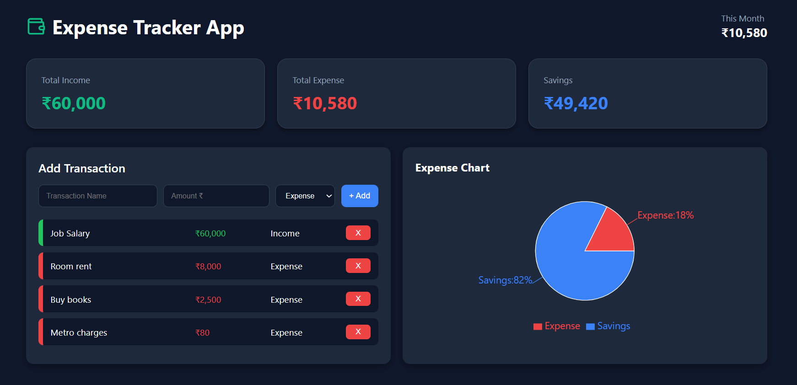

# Expense Tracker 💰

A modern expense tracker to manage your Income, Expense and Savings.  
Built with React + Recharts. Clean UI, responsive and data saved in browser.

## Live Demo
[ https://anuragfrontend-dev.github.io/expense-tracker/]( https://anuragfrontend-dev.github.io/expense-tracker/)

## ✨ Features
- **Track Transactions** - Add Income and Expense in 1 click
- **Live Dashboard** - Total Income, Total Expense, Total Savings cards
- **Visual Chart** - Pie chart shows Expense vs Savings % 
- **Responsive Design** - Works on Mobile, Tablet and Desktop
- **Local Storage** - Your data stays safe in browser
- **Dark Theme UI** - Easy on eyes with color coding

## 🛠️ Tech Stack
- **Frontend**: React, Vite, CSS3
- **Charts**: Recharts
- **Storage**: Browser LocalStorage

